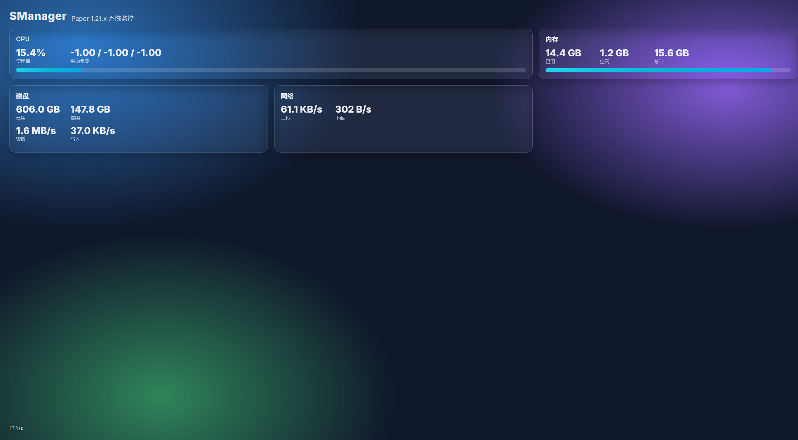

# SManager

基于 Paper 1.21.8 的 Minecraft 服务器系统监控插件。提供异步采集的系统资源指标、嵌入式 Web 仪表板、REST API 与 WebSocket 实时推送，帮助服主管理与可视化服务器运行状态。
The author is a bit lazy, so if you are a foreigner, please use a translation to read.
## 功能特性

- 系统资源监控
  - 内存：已用、空闲、总内存
  - CPU：总体使用率、1/5/15 分钟负载均值
  - 磁盘：总空间、空闲空间、读/写速率（B/s）
  - 网络：上传/下载速率（B/s）
- Web 服务（默认端口 25566，可配置）
  - REST：`GET /api/metrics` 返回最新快照；`GET /api/health` 健康检查
  - WebSocket：`/ws` 每秒推送最新数据
  - 内置简洁美观的仪表板页面（玻璃拟态、圆角、动画、响应式）
- 性能与安全
  - 异步数据采集，避免阻塞主线程
  - 快照缓存，API/WS 直接读取缓存
  - 可选访问令牌 `auth.token` 控制 API/页面/WS 访问
- 构建与兼容
  - Maven 项目，Java 21
  - Paper API 1.21.8-R0.1-SNAPSHOT（可根据需要调整）

## 快速开始

### 前置条件

- Java 21（JDK 21）
- Maven（或使用 IDE 内置 Maven）
- Paper 服务器（1.21.8）

### 构建

```bash
mvn -DskipTests package
```

构建产物：`target/SManager-1.0.0.jar`。

相关文件：
- [pom.xml](pom.xml)
- 插件主类：[SManagerPlugin.java](/src/main/java/com/aoao/smanager/SManagerPlugin.java)

### 安装与部署

1. 将 JAR 放到服务器 `plugins` 目录；
2. 启动服务器，首次运行会在 `plugins/SManager/config.yml` 写入默认配置；
3. 如需调整配置，修改后执行 `/smanager reload`（权限 `smanager.admin`，默认 OP）；
4. 访问仪表板：`http://<服务器IP>:<端口>/`（默认 25566）。

详细部署说明见：[docs/DEPLOY.md](/docs/DEPLOY.md)。

## 配置

默认配置：[config.yml](/src/main/resources/config.yml)

```yaml
monitor:
  intervalMillis: 1000  # 采样间隔（毫秒）
web:
  port: 25566           # Web 服务端口
auth:
  token: ""             # 访问令牌，留空不鉴权
```

命令与权限：

- `/smanager reload`：重载配置（需要 `smanager.admin`）

## API 概览

文档见：[docs/API.md](/docs/API.md)

- REST
  - `GET /api/metrics`：返回当前快照 JSON；
  - `GET /api/health`：返回 `ok`；
  - 如配置令牌：添加请求头 `Authorization: Bearer <token>` 或在 URL 加 `?token=<token>`。
- WebSocket
  - `ws://<host>:<port>/ws`（如有令牌，`?token=<token>`）；
  - 每秒推送一次快照（与 REST 返回格式一致）。

示例（curl）：

```bash
curl -H "Authorization: Bearer YOUR_TOKEN" http://localhost:25566/api/metrics
```

## 前端仪表板

- 入口页面：[index.html](/src/main/resources/web/index.html)
- 样式与脚本：
  - [styles.css](/src/main/resources/web/styles.css)
  - [app.js](/src/main/resources/web/app.js)

特性：玻璃拟态、圆角、渐变与动画、响应式布局；支持携带 `?token=YOUR_TOKEN` 访问受保护接口。

## 实现细节

- 监控采集：[MetricsCollector.java](/src/main/java/com/aoao/smanager/monitor/MetricsCollector.java)（基于 OSHI）
- 数据模型：[MetricsSnapshot.java](/src/main/java/com/aoao/smanager/monitor/MetricsSnapshot.java)（Jackson JSON 序列化）
- Web 服务：[WebServer.java](/src/main/java/com/aoao/smanager/web/WebServer.java)（Undertow，REST + WebSocket + 静态资源）
- 插件配置与命令：
  - [plugin.yml](/src/main/resources/plugin.yml)
  - [config.yml](/src/main/resources/config.yml)

设计要点：

- 使用 Paper 异步调度器按 `monitor.intervalMillis` 周期采样；
- 快照以原子引用缓存，API/WS 读取不加锁；
- Undertow 保持原包名与 SPI 文件，避免 XNIO Provider 发现失败；
- 打包使用 shade，但不最小化，确保反射/SPI 资源完整。

## 常见问题

- JNA 或 XNIO 相关错误：确保未对这些库做 relocation，且未最小化裁剪其 SPI/资源文件（当前配置已处理）。
- 首次速率为 0：磁盘与网络速率基于差分计算，首次启动因缺少前一时刻数据可能显示 0，随后会正常。
- 端口占用：修改 `web.port` 为未占用端口后 `/smanager reload`。

## 致谢

- PaperMC 社区与 Paper API
- [OSHI](https://github.com/oshi/oshi)：跨平台系统信息库
- [Undertow](https://undertow.io/)：轻量级高性能 Web 服务器
- Jackson：JSON 序列化

---

作者：Aoao  
QQ：785971038
Email：FZaoao@gmail.com 785971038@qq.com
仓库：https://github.com/USTCTI/Smanager
本项目所有解释权归FZaoao所有
建议请提交Issue
本项目完全免费，请勿用于商业用途，谢谢配合


本项目已在paper1.21.8服务端测试，请放心食用